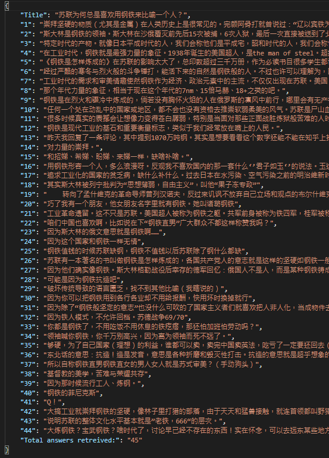

# Zhihu-crawler
A crawler for dynamic generated website such as Zhihu to extract personal information using Selenium

## Background
- Link of website: https://store.steampowered.com/ 
- Steam is one of the largest stores for PC game gamers to buy and download games from. According to their official data, there are around 20 million users logged into the Steam software at peak time every day and the daily data transferred (games download) is around 8,000 Gbps.
- This program intends to extract the information of gamers as well as the games and organize them into a more easy-interpretable format.

## Functions

### 1. General reports
1.	Enter the time period you want to view
2.	Return a csv file report with the following information:
  a.	Number of users logged into the software during the time (Average)
  b.	Most played games during the time

### 2. Store Game report
1.	Enter keyword for the game you want to search
2.	Return a csv file report about games that suits the search criteria with the following information:
  a.	Basic information of the game
  b.	Title of the game
  c.	Release date of the game
  d.	Genre of the game
  e.	Reviews of the game (Positive/Negative)

## Output
- Report for answers in .json format
- Report for users in .json format

### Sample

## Reference
- https://blog.csdn.net/qq_36962569/article/details/77200118?utm_medium=distribute.pc_relevant.none-task-blog-title-3&spm=1001.2101.3001.4242
